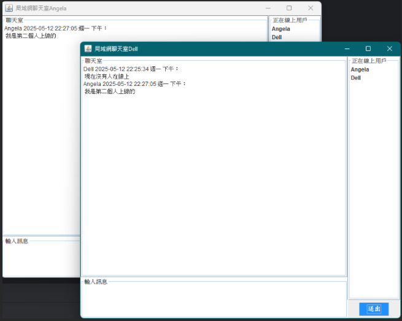

# 實際演示畫面





# 區域網路的通訊軟體 LAN Communication Software

## 需求

展示一個用戶的登入介面，這個介面只要求用戶輸入自己的暱稱就行。

登入後，展開一個群體聊天的窗口，這窗口會展示：在線人數、 展示消息展示框、發送輸入框、發送按鈕。實現即時通訊。

## 技術選型 Technology Selection

- 圖形介面程式設計：Swing

- 網路程式設計 Network Programming

- 物件導向設計 OOD

## 思路分析

### 1. 創建一個Module, 代表項目：LANCommunicationSoftware

### 2. 用戶登入介面：Swing

- 登入介面：這個介面只要求用戶輸入自己的暱稱就行
  
  ```java
  public class ChatEntryFrame extends JFrame{
      public ChatEntryFrame() {
          // 建立主視窗
          JFrame frame = new JFrame("區域網路聊天 - 進入介面");
          frame.setDefaultCloseOperation(JFrame.EXIT_ON_CLOSE);
          frame.setSize(400, 250);
          frame.setLocationRelativeTo(null);
          frame.setLayout(new BorderLayout());
  
          // 主面板設計
          JPanel panel = new JPanel(new GridBagLayout());
          panel.setBorder(BorderFactory.createEmptyBorder(20, 20, 20, 20));
  
          GridBagConstraints gbc = new GridBagConstraints();
          gbc.insets = new Insets(10, 10, 10, 10);
          gbc.fill = GridBagConstraints.HORIZONTAL;
  
          // 標題
          JLabel titleLabel = new JLabel("請輸入暱稱", SwingConstants.CENTER);
          titleLabel.setFont(new Font("標楷體", Font.BOLD, 18));
          gbc.gridx = 0;
          gbc.gridy = 0;
          gbc.gridwidth = 2;
          panel.add(titleLabel, gbc);
  
          // 暱稱輸入框
          JTextField nicknameField = new JTextField(15);
          nicknameField.setFont(new Font("標楷體", Font.PLAIN, 14));
          gbc.gridx = 0;
          gbc.gridy = 1;
          gbc.gridwidth = 2;
          panel.add(nicknameField, gbc);
  
          // 按鈕區域
          JButton enterButton = new JButton("進入");
          JButton cancelButton = new JButton("取消");
  
          // 按鈕美化
          enterButton.setFont(new Font("標楷體", Font.BOLD, 14));
          enterButton.setBackground(new Color(30, 144, 255)); // 深藍色
          enterButton.setForeground(Color.WHITE);
  
          cancelButton.setFont(new Font("標楷體", Font.BOLD, 14));
          cancelButton.setBackground(new Color(220, 20, 60)); // 紅色
          cancelButton.setForeground(Color.WHITE);
  
          // 設定按鈕事件
          enterButton.addActionListener(e -> {
              String nickname = nicknameField.getText().trim();
              if (!nickname.isEmpty()) {
                  JOptionPane.showMessageDialog(frame, "歡迎 " + nickname + " 進入聊天系統！", "成功", JOptionPane.INFORMATION_MESSAGE);
                  // 關閉登入介面
                  frame.dispose();
                  // 成功進入聊天室
                  new ChatRoomFrame(nickname);
              } else {
                  JOptionPane.showMessageDialog(frame, "請輸入暱稱！", "錯誤", JOptionPane.ERROR_MESSAGE);
              }
          });
  
          cancelButton.addActionListener(e -> frame.dispose());
  
          gbc.gridx = 0;
          gbc.gridy = 2;
          gbc.gridwidth = 1;
          panel.add(enterButton, gbc);
  
          gbc.gridx = 1;
          panel.add(cancelButton, gbc);
  
          // 設置面板到視窗
          frame.add(panel, BorderLayout.CENTER);
          frame.setVisible(true);
      }
  }(panel, BorderLayout.CENTER);
          frame.setVisible(true);
      }
  ```

- 獲取聊天室的UI介面
  
  ```java
  public class ChatRoomFrame extends JFrame {
      public ChatRoomFrame(String nickname) {
          // 設定視窗
          JFrame frame = new JFrame("局域網聊天室" + nickname);
          frame.setDefaultCloseOperation(JFrame.EXIT_ON_CLOSE);
          frame.setSize(700, 600);
          frame.setLayout(new BorderLayout());
  
          // **左邊區域（聊天室 + 輸入框）**
          JPanel leftPanel = new JPanel(new BorderLayout());
  
          // 左上（聊天內容）
          JTextArea chatArea = new JTextArea();
          chatArea.setEditable(false);
          chatArea.setBorder(BorderFactory.createTitledBorder("聊天室"));
          leftPanel.add(new JScrollPane(chatArea), BorderLayout.CENTER);
  
          // 左下（輸入框）
          JTextArea inputField = new JTextArea(4, 20); // 4 行高
          inputField.setBorder(BorderFactory.createTitledBorder("輸入訊息"));
          leftPanel.add(inputField, BorderLayout.SOUTH);
  
          // **右邊區域（使用者名單 + 送出按鈕）**
          JPanel rightPanel = new JPanel(new BorderLayout());
  
          // 右上（在線使用者名單）
          DefaultListModel<String> userListModel = new DefaultListModel<>();
          userListModel.addElement("Alice");
          userListModel.addElement("Bob");
          userListModel.addElement("Charlie");
          JList<String> userList = new JList<>(userListModel);
          userList.setBorder(BorderFactory.createTitledBorder("正在線上用戶"));
          userList.setFixedCellWidth(100); // 擴展寬度
          rightPanel.add(new JScrollPane(userList), BorderLayout.CENTER);
  
          // 右下（送出按鈕）
          JButton sendButton = new JButton("送出");
          sendButton.setFont(new Font("標楷體", Font.BOLD, 14));
          sendButton.setBackground(new Color(30, 144, 255)); // 深藍色
          sendButton.setForeground(Color.WHITE);
  
          sendButton.addActionListener(e -> {
              String message = inputField.getText().trim();
              if (!message.isEmpty()) {
                  chatArea.append(nickname + "：" + message + "\n");
                  inputField.setText("");
              }
          });
  
          JPanel buttonPanel = new JPanel();
          buttonPanel.add(sendButton);
          rightPanel.add(buttonPanel, BorderLayout.SOUTH);
  
          // **添加區塊到視窗**
          frame.add(leftPanel, BorderLayout.CENTER);
          frame.add(rightPanel, BorderLayout.EAST);
  
          frame.setVisible(true);
      }
  }el, BorderLayout.EAST);
  
          frame.setVisible(true);
      }
  }
  ```

### 3. 定義一個APP啟動類：創建進入介面並展示。

```java
public class APP {
    public static void main(String[] args) {
        new ChatEntryFrame();
    }
}
```

### 4. 系統架構 -  開發Server端

- 接收Client端的管道連接。

- 接收登入消息、接收暱稱信息、Clinet端發過來的群發消息。

- Server存儲全部在線的Socket管道，以便在線人數、Client轉發消息。

- 如果Server收到登入消息，接收暱稱。就需要更新所有Client端在線人數列表。

- 如果Server收到群聊消息，接收這個人的信息，再轉發給所有Client展示這個消息。

### 5. 開發服務端

#### 1.創建一個Server的Module：chat-server

#### 2.創建一個Server啟動類，啟動Server等待Client的連接

```java
public class Server {
    public static void main(String[] args) {
        System.out.println("啟動服務端系統 . . . .");

        try {
            // 1. 註冊端口
            ServerSocket serverSocket = new ServerSocket(Constant.PORT);
            // 2. 主線程負責接受客戶端的連接請求
            while (true) {
                // 3. 調用accept方法，獲取到客戶端的Socket對象
                System.out.println("等待客戶端的連接 . . . . .");
                Socket socket = serverSocket.accept();
                System.out.println("一個客戶端的連接 . . . . .");
            }
        } catch (Exception e) {
            e.printStackTrace();
        }
    }
}
```

#### 3. 把socket交給一個獨立線程處理，以便支持多個客戶端同時進入系統通訊。

```java
   // 3. 調用accept方法，獲取到客戶端的Socket對象
                System.out.println("等待客戶端的連接 . . . . .");
                Socket socket = serverSocket.accept();
                new ServerReaderThread(socket).start();
                System.out.println("一個客戶端的連接 . . . . .");
```

#### 4.定義一個集合容器來存所有登入進來的客戶端Socket，以便將來群發消息給用戶。

- 這個集合只需要一個記住所有Socket 【註冊表】
  
  使用Map集合，Key是存儲客戶端的管道，Value是用戶的暱稱。
  
  因為Scoket值會是唯一，所以適合當Key

```java
// 定義一個集合容器來存所有登入進來的客戶端Socket，以便將來群發消息給用戶。
    public static final Map<Socket, Socket> onLineSockets = new HashMap<>();
```

#### 5.Server線程要開始接收登入消息、群聊訊息

- 接收的訊息會很多類型： 登入消息、群聊訊息、私聊訊息
  
  > 客戶端必須聲明協議發送消息
  > 
  > 客戶端發1，代表是登入消息
  > 
  > 客戶端發2，代表是群聊消息

```java
public class ServerReaderThread extends Thread {
private Socket socket;
    public ServerReaderThread(Socket socket) {
        this.socket = socket;
    }

    @Override
    public void run() {
        try {
            // 接收的訊息會很多類型： 登入消息、群聊訊息
            // 先從Socket中接收Client發過來的消息類型編號
            DataInputStream dataInputStream = new DataInputStream(socket.getInputStream());
            int type = dataInputStream.readInt();
            // 客戶端發1，代表是登入消息
            // 客戶端發2，代表是群聊消息
            switch (type) {
                case 1:
                    // 登入消息，需要接收暱稱，在更新所有在線人數列表
                    break;
                case 2:
                    // 群聊消息，需要接收群聊消息內容，在把群聊消息發給所有在線人數
                    break;
                default:
            }

        } catch (Exception e) {
            System.out.println(socket.getInetAddress().getHostAddress() +"用戶下線了");
        }
    }
}
```

#### 6.實現服務端消息接收

```java
package com.dell;

import java.io.DataInputStream;
import java.io.DataOutputStream;
import java.net.Socket;
import java.util.Collection;


public class ServerReaderThread extends Thread {
private Socket socket;
    public ServerReaderThread(Socket socket) {
        this.socket = socket;
    }

    @Override
    public void run() {
        try {
            // 接收的訊息會很多類型： 登入消息、群聊訊息
            // 先從Socket中接收Client發過來的消息類型編號
            DataInputStream dataInputStream = new DataInputStream(socket.getInputStream());
            int type = dataInputStream.readInt();
            // 客戶端發1，代表是登入消息
            // 客戶端發2，代表是群聊消息
            switch (type) {
                case 1:
                    // 登入消息，需要接收暱稱，在更新所有在線人數列表
                    String nickname = dataInputStream.readUTF();
                    // 把當前的Socket存進"註冊表onLineSockets"中
                    Server.onLineSockets.put(socket, nickname);
                    updateClientOnLineUserList();
                    break;
                case 2:
                    // 群聊消息，需要接收群聊消息內容，在把群聊消息發給所有在線人數
                    break;
                default:
            }

        } catch (Exception e) {
            System.out.println(socket.getInetAddress().getHostAddress() +"用戶下線了");
            Server.onLineSockets.remove(socket); // 將下線的Client socket從在線人數列表中
        }
    }

    private void updateClientOnLineUserList() {
        // 更新全部Client的在線人數列表

        // 1. 拿到當前在線所有用戶的暱稱
        Collection<String> onLineUsers = Server.onLineSockets.values();

        // 2. 把這些暱稱，透過Socket傳回給Client
        for (Socket socket : Server.onLineSockets.keySet()) {
            try {
                // 3. 透過字節輸出流，傳回給Client
                DataOutputStream dataOutputStream = new DataOutputStream(socket.getOutputStream());
                // 4. 在傳回更新之前，需要給Client一個信標，表示傳回的類型
                // 傳1：在線人數列表信息；傳2:群聊訊息
                dataOutputStream.writeInt(1);
                for (String onLineUser : onLineUsers) {
                    dataOutputStream.writeUTF(onLineUser);
                }

                // 刷新Socket管道
                dataOutputStream.flush();
            } catch (Exception e) {
                e.printStackTrace();
            }
        }
    }
}
```

#### 7. 實現用戶下線的系統通知

```java
 System.out.println(socket.getInetAddress().getHostAddress() +"用戶下線了");
            String offLineName = Server.onLineSockets.remove(socket);// 將下線的Client socket從在線人數列表中
            showUserOffLine(offLineName);
            updateClientOnLineUserList(); // 更新在線人數列表
```

```java
private void showUserOffLine(String offLineName) {
        // 🔥 通知所有仍在線的客戶端該用戶下線
        for (Socket activeSocket : Server.onLineSockets.keySet()) {
            try {
                DataOutputStream dataOutputStream = new DataOutputStream(activeSocket.getOutputStream());
                dataOutputStream.writeInt(3); // 代表下線通知
                dataOutputStream.writeUTF(offLineName + " 已離線");
                dataOutputStream.flush();
            } catch (Exception e) {
                System.out.println("發送離線通知時發生錯誤：" + e.getMessage());
            }
        }
    }
```

```java
case 3:
                        // Server發來的群聊消息
                        showOffLineUserMessage();
                        break;
```

```java
private void showOffLineUserMessage() throws Exception {
        String offLineMsg = dataInputStream.readUTF();
        chatRoomFrame.setMsgToWin(offLineMsg);
    }
```

### 6. 實現接收客戶端的群聊消息

#### 1. 給登入按鈕綁定一個事件監聽器，觸發後立即與Server's socket請求連結

```java
// **按鈕事件 - 登入**
        enterButton.addActionListener(e -> {
            // **獲取使用者輸入的暱稱，並去除頭尾空格**
            String nickname = nicknameField.getText().trim();
            if (!nickname.isEmpty()) { // 確保輸入不為空
                // 顯示歡迎消息
                JOptionPane.showMessageDialog(frame, "歡迎 " + nickname + " 進入聊天系統！", "成功", JOptionPane.INFORMATION_MESSAGE);
                try {
                    login(nickname);
                    // **關閉登入介面**
                    frame.dispose();
                    // **成功進入聊天室，開啟主聊天視窗**
                    new ChatRoomFrame(nickname, socket);
                } catch (Exception ex) {
                    ex.printStackTrace();
                }
            } else {
                // 如果暱稱為空，顯示錯誤提示
                JOptionPane.showMessageDialog(frame, "請輸入暱稱！", "錯誤", JOptionPane.ERROR_MESSAGE);
            }
        });
```

```java
// 登入聊天室
    private void login(String nickname) throws Exception {
        // 立即發送登入消息給Server
        // 1. 創建Socket請求與Server的Socket連結
        Socket socket = new Socket(Constant.SERVER_IP, Constant.SERVER_PORT);

        // 2. 傳送消息類型編號、暱稱，給Server的Socket
        DataOutputStream dataOutputStream = new DataOutputStream(socket.getOutputStream());
        dataOutputStream.writeInt(1); // 傳1：暱稱
        dataOutputStream.writeUTF(nickname);
        dataOutputStream.flush(); // 更新
    }
```

#### 2. 進入聊天室後，須立即讀取Client's Socket從Server發來的在線人數列表/群聊訊息

- 負責讀取Server發來的在線人數列表/群發消息

- 收消息後，判斷是為在線人數列表更新/群聊訊息
  
  ```java
  package com.dell.ui;
  
  import java.io.DataInputStream;
  import java.net.Socket;
  import java.util.ArrayList;
  import java.util.List;
  ```
  
  public class ClientReaderThread extends Thread {
  private Socket socket;
  private ChatRoomFrame chatRoomFrame;
  private DataInputStream dataInputStream;
  
      public ClientReaderThread(Socket socket, ChatRoomFrame chatRoomFrame) {
          this.chatRoomFrame = chatRoomFrame;
          this.socket = socket;
      }
      
      @Override
      public void run() {
          try {
              // 接收的訊息會很多類型： 1.登入消息、 2.群聊訊息
              // 先從Socket中接收Client發過來的消息類型編號
              dataInputStream = new DataInputStream(socket.getInputStream());
              while (true) {
                  // Server發1，代表是登入消息
                  // Server發2，代表是群聊消息
                  int type = dataInputStream.readInt(); //消息類型種類
                  switch (type) {
                      case 1:
                          // Server發來的在線人數更新消息
                          updateClientOnLineUsersListFromServer();
                          break;
                      case 2:
                          // Server發來的群聊消息
      
                          break;
                  }
              }
          } catch (Exception e) {
             e.printStackTrace();
          }
      }
      
      // 更新在線用戶列表
      private void updateClientOnLineUsersListFromServer() throws Exception {
          // 從Server會傳過來
          // 1. 消息類型種類
          // 2. 多少個在線人數
          // 3. 每個人的暱稱
          int count = dataInputStream.readInt();
      
          // 需要有個集合來裝這些暱稱
          String[] onLineNicknameList = new String[count];
          for (int i = 0; i < count; i++) {
              onLineNicknameList[i] = dataInputStream.readUTF();
          }
      
          // 更新窗口介面右側
          chatRoomFrame.updateOnLineUsers(onLineNicknameList);
      }
  
  }

```
#### 3. 接收群聊消息

- 消息類型：2。聊天室展示消息

```java
switch (type) {
                    case 1:
                        // Server發來的在線人數更新消息
                        updateClientOnLineUsersListFromServer();
                        break;
                    case 2:
                        // Server發來的群聊消息
                        getMsgToWin();
                        break;
                }
```

```java
private void getMsgToWin() throws Exception {
        String msg = dataInputStream.readUTF();
        chatRoomFrame.setMsgToWin(msg);
    }
```

```java
// 將群聊消息顯示在聊天室中
    public void setMsgToWin(String msg) {
        chatArea.append(msg);
    }
```

#### 4. 發送群聊消息

- 給"發送" 按鈕綁定一個事件監聽器，發送給Server消息類型2，在發送訊息內容 

- ```java
  // 將送出按鈕綁定事件監聽器
          sendButton.addActionListener(e -> {
              String message = inputField.getText().trim();
              if (!message.isEmpty()) {
                  // 清空訊息輸入欄
                  inputField.setText("");
                  // 發送消息
                  sendMsgToServer(message);
              }
          });
  ```

- ```java
  private void sendMsgToServer(String message) {
          // 1. 從Socket中得到一個特殊數據輸出流
          try {
              DataOutputStream dataOutputStream = new DataOutputStream(socket.getOutputStream());
              dataOutputStream.writeInt(2);
              dataOutputStream.writeUTF(message);
              dataOutputStream.flush(); // 刷新數據，以免內存還有殘渣
          } catch (Exception e) {
              e.printStackTrace();
          }
      }
  ```
